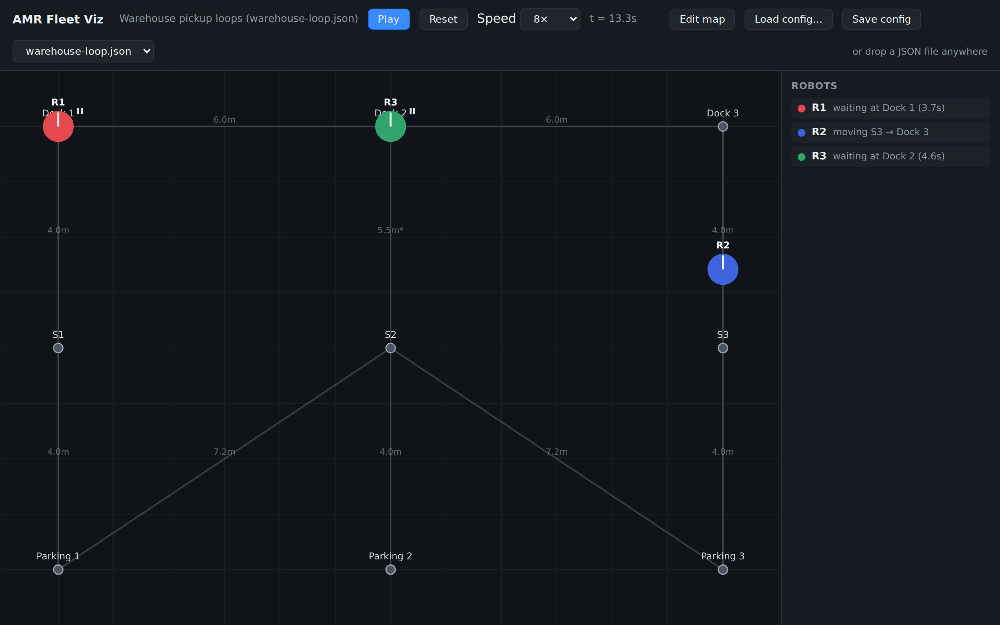

# amr-fleet-viz

Visualize how a fleet of delivery robots behaves when multiple units share the same space.



A browser-based simulator: it draws a 2D map of waypoints, then animates multiple autonomous mobile robots (AMRs), each following its own fixed route — moving in straight lines between waypoints, turning in place when the direction changes, and pausing at designated stops. Robots that come close to each other are highlighted, so you can spot where routes interfere.

## Getting started

```sh
npm install
npm run dev     # open the printed URL (default http://localhost:5173)
```

`npm run build` produces a static site in `dist/` that can be hosted anywhere.

## Usage

- A sample scenario loads automatically. Pick another from the dropdown, click **Load config…**, or drag & drop a JSON file onto the page.
- **Pause / Play**, **Reset**, and the **Speed** selector (0.5×–8×) control the simulation clock.
- The sidebar shows each robot's live status (moving / turning / waiting / idle).
- Two robots closer than 0.8 m are ringed in red — a hint that their routes conflict at that moment.

### Map editor

Click **Edit map** to build or adjust the map directly on the canvas:

- **Double-click** empty space to add a waypoint. Positions snap to a grid (1 / 0.5 / 0.25 / 0.1 m, or off) so maps stay neatly aligned.
- **Drag** a waypoint to move it (snapped); select it to edit its id, label, and exact coordinates in the sidebar. A waypoint on one fixed-distance edge can't stretch that edge — it swings on an arc around its neighbor; with two or more fixed-distance edges it is locked to its coordinates (edit x/y in the sidebar).
- **Shift+click** another waypoint while one is selected to connect an edge, then type an explicit **distance** in the sidebar (leave empty for the automatic straight-line distance).
- **Del** removes the selected waypoint or edge. Waypoints used by a robot's route are protected — and edits that would break the scenario are rejected and rolled back.
- **Save config** downloads the current scenario (map + robots) as JSON, so anything built in the UI stays portable.

Robot definitions (speeds, turn times, routes, waits) are edited in the JSON file for now.

## Configuration files

Scenarios are plain JSON files, so they are easy to version, share, and generate. Samples live in [`public/configs/`](public/configs/).

```jsonc
{
  "name": "Warehouse pickup loops",
  "map": {
    "nodes": [
      // Waypoints. Coordinates are in meters (y points up).
      { "id": "P1", "x": 0, "y": 0, "label": "Parking 1" },
      { "id": "S2", "x": 6, "y": 4 },
      { "id": "D2", "x": 6, "y": 8, "label": "Dock 2" }
    ],
    "edges": [
      // Optional. "distance" overrides the Euclidean distance between the
      // two nodes — e.g. to model a detour that is not drawn on the map.
      // Overridden edges are labeled in amber with a "*" on the canvas and
      // keep their value when nodes are moved; edges without an override
      // recompute automatically.
      { "from": "S2", "to": "D2", "distance": 5.5 }
    ]
  },
  "robots": [
    {
      "id": "R1",
      "color": "#e5484d",        // optional; auto-assigned when omitted
      "speedMps": 1.0,           // straight-line speed, meters/second
      "turnDurationSec": 2,      // seconds per in-place turn
      "loop": true,              // repeat the route forever
      "startDelaySec": 3,        // optional; hold before the first departure
      "route": [
        { "node": "P1", "waitSec": 2 },  // pause 2 s at this stop
        "S2",                            // shorthand: no wait
        { "node": "D2", "waitSec": 5 },
        "S2",
        "P1"
      ]
    }
  ]
}
```

### Semantics

- **Distance between waypoints** defaults to the straight-line distance computed from node coordinates; declare an edge with `distance` to override it.
- **Movement**: a robot travels each hop at its `speedMps`, taking `distance / speedMps` seconds.
- **Turning**: whenever the travel direction changes at a waypoint, the robot spends `turnDurationSec` seconds rotating in place before departing.
- **Waiting**: `waitSec` on a route stop pauses the robot there before it turns and departs.
- **Looping**: with `"loop": true` the robot returns to its first stop (an implicit final hop is added if the route doesn't already end there) and repeats forever. Without it, the robot goes idle at the last stop.
- Routes are fixed — there is no path planning or collision avoidance. That's the point: the visualizer shows you *where* fixed routes would interfere.

## Development

- `npm run dev` — dev server with hot reload
- `npm run build` — type-check and bundle to `dist/`
- `npm run preview` — serve the production build locally
- `npm run screenshot [-- <simSeconds> <out.png>]` — capture `docs/screenshot.png` headlessly with Playwright (run `npx playwright install chromium` once)

Source layout: `src/config.ts` (schema validation), `src/simulation.ts` (per-robot timelines), `src/renderer.ts` (canvas drawing), `src/main.ts` (UI wiring).
